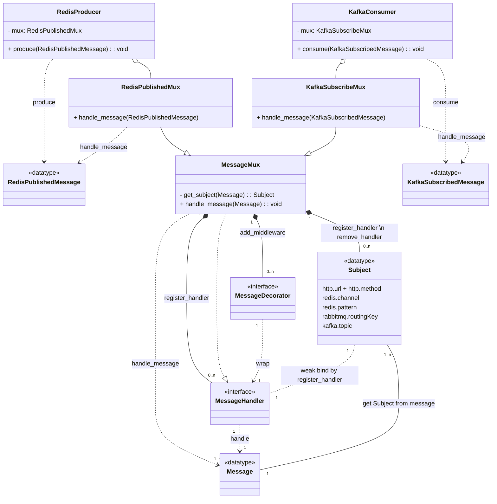

# multiplex guide

mux 通常是指一個 路由器（router）或 多路徑匹配器（multiplexer），它可以用來處理不同的 Message。

Message represents a high-level abstraction containing metadata (e.g. header) + body

利用字串的弱引用特性，將 subject 和 handler 榜定。

所謂 subject 在不同的介接系統，有不同的呈現方式，  
比如：http.url、redis.channel、rabbitmq.routingKey、kafka.topic，  
最後 subject 會路由到相應的處理程序（handler）。  

## uml 

MessageMux 本身也是一個 MessageHandler，只是多了路由能力。

依照需求和不同的介接元件互動時，在 adapter layer 定義 multiplex 衍生型別，  
以下圖為例，分別介紹 kafka、redis 與 MessageMux 關聯性。  

路由功能由 MessageMux 提供，  
需要全新撰寫的程式碼的地方是 接收訊息(consume) 或 組合訊息(produce)，  
以及每個 message handler。  



## mux 使用步驟

1. define get_Subject function
2. new mux 
3. add_middleware (option)
4. register_handler
5. handle_message

```python
class RedisMessage:
    def __init__(self, channel, payload):
        self.channel: str = channel
        self.payload: any = payload


def redis_middleware1(next: MessageHandler) -> MessageHandler:
    def middleware(dto: RedisMessage):
        print(f"Middleware 1 before")
        next(dto)
        print(f"Middleware 1 after")

    return middleware


def redis_middleware2(next: MessageHandler) -> MessageHandler:
    def middleware(dto: RedisMessage):
        print(f"Middleware 2 before")
        next(dto)
        print(f"Middleware 2 after")

    return middleware

if __name__ == '__main__':
    # 1. define get_subject function
    def get_subject(dto):
        return f'v1/{dto.channel}'

    # 2. new mux
    redis_mux = MessageMux(get_subject=get_subject)

    # 3. add_middleware (option)
    redis_mux.add_middleware(redis_middleware1, redis_middleware2)
    
    # 4. register_handler
    channel = "Created.Order"
    redis_mux.register_handler(f'v1/{channel}', lambda msg: print(f"topic={msg.channel} payload={msg.payload}"))

    # 5. handle_message
    message1 = RedisMessage(channel, {"order_id": "uuid_v4"})
    redis_mux.handle_message(message1)
    # Middleware 1 before
    # Middleware 2 before
    # topic=Created.Order payload={'order_id': 'uuid_v4'}
    # Middleware 2 after
    # Middleware 1 after

    message2 = RedisMessage("Registered.User", {"user_id": "uuid_v4"})
    redis_mux.handle_message(message2)
    #     raise NotFoundError(f"subject={subject} does not exist in mux")
    # __main__.NotFoundError: subject=v1/Registered.User does not exist in mux
```
